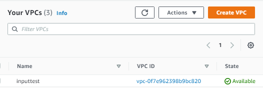
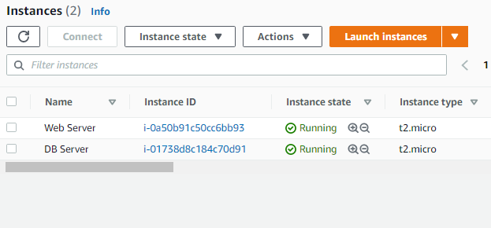

# terraform
Terraform notes and steps completed. Plus, mistakes I made along the way. 

- [x] Create AWS account - user = 'terraform'
- [x] Powershell - right click and run as Admin
- [x] Install chocolatey. [Copy and paste code in Powershell](https://chocolatey.org/install). Then 'choco install terraform'. Check version `terraform version`.
- [x] Install [AWS CLI](aws.amazon.com/cli). In Powershell, `aws configure`. (Error: Close and reopen Powershell if 'aws command not found' error.)
- [x] After 'aws configure', add access key and secret key, then default region, and enter for JSON (or type 'json').
- [x] In VSC code (make sure Terraform extension is installed. Close and reopen, then `terraform init` first after install), terraform > resource > main.tf. Then cd into 'resource' folder. (Error: If there's an error when you `terraform init`, make sure you cd to 'resource' folder.)
- [x] Inside main.tf (Terraform config file), add this: (Error: It's aws_vpc not aws-vpc!)
```
provider "aws" {
  region = "us-east-1"
}

resource "aws_vpc" "myvpc" {
  cidr_block = "10.0.0.0/16"
}
```
- [x] From terminal (inside 'resource' folder) - `terraform init` -> `terraform plan` ->  `terraform apply` -> type 'yes' to approve, check if [VPC is created](https://console.aws.amazon.com/vpc/home) -> then `terraform destroy`. 



- [x] Created variables. (Error: Make sure to close brackets.)
```
variable "inputname" {
  type = string
  description = "Set the name of the VPC."
}

resource "aws_vpc" "myvpc" {
  cidr_block = "10.0.0.0/16"

  tags = {
    Name = var.inputname 
  }
}
```
Then `terraform apply` and enter a value - the name of the VPC you want to create. Then 'yes' to create.

---
Notes from [Getting Started with Terraform](https://cloudskills.io/blog/terraform-aws-1), [Intro to Terraform](https://hackernoon.com/hashicorps-terraform-a-introduction-7f2034ae), [Terraform references for AWS](https://registry.terraform.io/providers/hashicorp/aws/latest)

Syntax
```
<BLOCK TYPE> "<BLOCK LABEL>" "<BLOCK LABEL>" {
  # Block body
  <IDENTIFIER> = <EXPRESSION> # Argument
}
```
Workflow = init –> plan –> apply –> destroy (IPAD or IAD)
1. `terraform init` - This command downloads and installs providers used in the configuration (Ex. AWS).
2. `terraform plan` - This creates execution plan. Checks for syntax errors, API authentication, state verification, etc. Shows what needs to be fixed, what was created, and what needs to be created.
3. `terraform apply` -  This executes the plan. Type 'yes' to approve and create resource/infrastructure. Also applies any changes made to the existing resources.
4. `terraform destroy` - This destroys any resources made. Also confirm with 'yes'.

---

Create an instance
```
provider "aws" {
  region = "us-east-1"
}

resource "aws_instance" "ec2" {
  ami           = "ami-0533f2ba8a1995cf9"
  instance_type = "t2.micro"
}
```

---

Create an EIP
```
provider "aws" {
  region = "us-east-1"
}

resource "aws_instance" "ec2" {
  ami           = "ami-0533f2ba8a1995cf9"
  instance_type = "t2.micro"
}

resource "aws_eip" "elasticeip" {
  instance = aws_instance.ec2.id
}

output "EIP" {
  value = aws_eip.elasticeip.public_ip
}
```

to reference a resource defined - resource.name.property = aws_instance.ec2.id

---

## Dynamic Blocks

[Dynamic Blocks](https://www.terraform.io/docs/language/expressions/dynamic-blocks.html) 

> A dynamic block acts much like a for expression, but produces nested blocks instead of a complex typed value.
> Best Practices for dynamic Blocks - Overuse of dynamic blocks can make configuration hard to read and maintain, so we recommend using them only when you need to hide details in order to build a clean user interface for a re-usable module. Always write nested blocks out literally where possible.

TL;DR - DB helps to reduce repetitive codes.

```
variable "ingress" {
  type = list(number)
  default = [80,443]
}

resource "aws_security_group" "webtraffic" {
  name = "Allow HTTPS"

  dynamic "ingress" { 
    iterator = port 
    for_each = var.ingressrules 
    content {
      from_port   = port.value
      to_port     = port.value
      protocol    = "TCP"
      cidr_blocks = ["0.0.0.0/0"]
    }
  }
}
```
- "ingress" specifies what kind of nested block to generate.
- iterator argument (optional) sets the name of a temporary variable that represents the current element.
- for_each argument provides the complex value to iterate over. If omitted, var name defaults to the label of the dynamic block "ingress".
- nested content block defines the body of each generated block. You can use the temporary iterator variable inside this block.

[view main.tf file](https://github.com/mguery/terraform/blob/main/main.tf)



---

## Modules
[Terraform Registry for AWS](https://registry.terraform.io/providers/hashicorp/aws/latest)
Module is a folder with code inside. (Think: SASS/SCSS modules structure) 
Create modules folder with main.tf inside. Create another folder for each resource and a file. (modules > ec2 > ec2.tf) You would add any code related to the resource/label here(?)

In modules > main.tf, create module block for each resource/label 
```
module "db" {
  source = ./db
}
```
