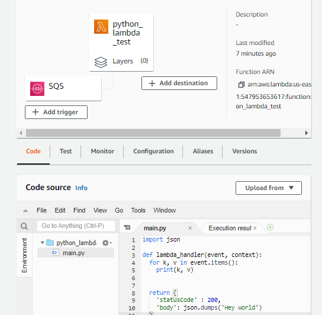

Notes from Lambda SQS project

`terraform apply -auto-approve` - auto approves plan, no need to type yes

<https://www.terraform.io/docs/cli/commands/plan.html>
`terraform plan -out myplan.tfplan`
this command creates a plan for a reviewer to go over the plan. if it passes the plan, you can approve the process to be deployed

`terraform apply "myplan.tfplan` - applies the plan to the env

Error: 
"The provided execution role does not have permissions to call ReceiveMessage on SQS"
When lambda is created, it needs to be assigned a lambda execution role. <https://docs.aws.amazon.com/lambda/latest/dg/lambda-intro-execution-role.html>

Lambda console > pick the function > Configuration > Permissions > under Execution role > pick Role name > attach policy AWSLambdaSQSQueueExecutionRole 

